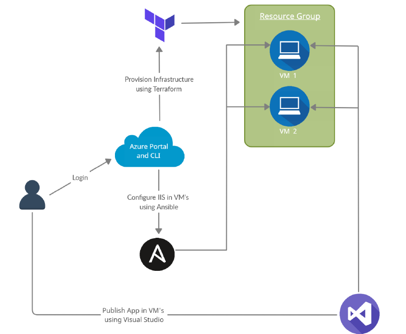

# INFRASTRUCTURE AS CODE

## Using Terraform and Ansible

### Terraform

Terraform is a tool for building, changing, and versioning infrastructures safely and efficiently. Terraform can manage existing and popular service providers as well as custom in-house solutions.

There are three main parts in Terraform project:
1. [main.tf](https://github.com/zul-m/IaC.Terraform.Ansible/blob/main/main.tf) – In the case of simple projects this is the file that has all the code to build up infrastructure, it contains all the modules and data sources that are needed. If the project is bigger and complex, the files are logically split based on the functionalities.
2. [variables.tf](https://github.com/zul-m/IaC.Terraform.Ansible/blob/main/variables.tf) – It stores the declarations for the variables which are referenced in main.tf.
3. [terraform.tfvars](https://github.com/zul-m/IaC.Terraform.Ansible/blob/main/terraform.tfvars) – It is used to define the default values of the variables.

The configuration files written in HashiCorp Configuration Language (HCL) describe the resources and components which are required to run application. Terraform will then go ahead and produce an execution plan describing the steps to reach the desired state, and then goes ahead and executes it. If there are changes that are applied to the configuration files, terraform sees what is changed and based on it creates incremental execution plans.

### Ansible

Ansible is a tool that can do a lot more than configuring existing infrastructures. It is primarily known for the configuration tasks as it is very easy to do it using Ansible. A whole network of computers can be configured using Ansible at once. The primary architecture of Ansible consists of two kinds of nodes – Control and Managed nodes. A Control node is the main system that has Ansible installed on it, while the managed nodes are the clients that are connected to the Control node using SSH (secure shell) or any other authentication techniques. The Control node has a host inventory file containing the addresses of the Managed nodes.
The Control node sends configuration programs which are known as modules to the Managed nodes. These programs are saved as Ansible playbooks (name of the Ansible specific configuration files written in YAML) on the Control node. These modules compare the states of various Managed nodes to what is mentioned in the modules, finds the mismatch, and then updates the state of the managed nodes.

### Deployment plan

Here's the design of the project which we are going to implement:

    

1. The user will login into the Azure portal and use Azure Cloud Shell to run Terraform and Ansible scripts.
2. Terraform scripts are run and a resource group with two Windows VMs having proper network configurations are created.
3. After the successful creation of VMs, IIS (Internet Information Services – a web server software package specifically designed for windows) and some other modules are configured on both VMs using their IP’s. They are required to run an ASP.NET web app on a Windows server.
4. A self-created web app or app cloned from the provided GitHub link is published on both VMs using Visual Studio 2019 and accessed through the public IP of the load balancer.